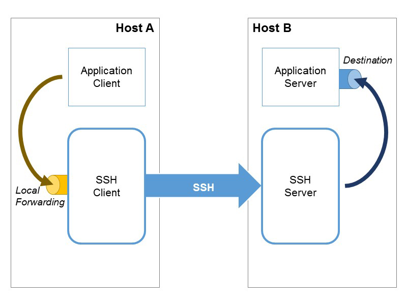

# mongoose-ssh-tunnel

Example of Mongoose Connection via SSH Tunnel

## Node.js modules:
- [dotenv](https://www.npmjs.com/package/dotenv) load environment variables from `.env` (optinal)
- [mongoose](https://www.npmjs.com/package/mongoose) MongoDB Object Modeling Tool
- [tunnel-ssh](https://www.npmjs.com/package/ssh-tunnel) SSH Tunnel management utility

## SSH Tunneling Local Forwarding - Logical Diagram


## Example SSH Tunnel Configuration

SSH server connection
```
username: process.env.SSH_USERNAME,
password: process.env.SSH_PASSWORD,
host: process.env.SSH_HOST,
port: process.env.SSH_PORT || "22",
```
Destination
```
dstHost: "localhost",
dstPort: "27017",
```
Local Forwarding
```
# Local Forwarding
localHost: "127.0.0.1",
localPort: "27000"
```
